# ☸️ Microservices Kubernetes Deployment Task

## 📌 Problem Analysis
You are provided with source code for **four Node.js microservices**:
- **User Service** (Port 3000)  
- **Product Service** (Port 3001)  
- **Order Service** (Port 3002)  
- **Gateway Service** (Port 3003)  

The challenge is to **containerize** each service, push images to DockerHub, and orchestrate them with **Kubernetes**.  
Key requirements:
- Each service must have its own **Deployment manifest**.  
- Each service must have a corresponding **Service manifest**.  
- Services should communicate via **ClusterIP service discovery**.  
- Documentation must include setup, testing, troubleshooting, and screenshots.  

---

## 📂 Repository Structure
```
C:\herovired\skillAssessment2\Microservices-Task
│   .gitignore
│   LICENSE
│   README.md
│   skillassignment1-README.md
│
├── screenshots/
│   ├── pods.png
│   ├── logs.png
│   └── service-test.png
│
└── Microservices/
    │   docker-compose.yml
    │   package-lock.json
    │
    ├── gateway-service/
    ├── order-service/
    ├── product-service/
    ├── user-service/
    │
    └── k8s/
        ├── deployments/
        │   ├── user-service.yaml
        │   ├── product-service.yaml
        │   ├── order-service.yaml
        │   └── gateway-service.yaml
        │
        └── services/
            ├── user-service.yaml
            ├── product-service.yaml
            ├── order-service.yaml
            └── gateway-service.yaml
```

---

## 🚀 Solution Implementation (Step‑by‑Step)

### Step 1: Kubernetes Setup
Switch context to Docker Desktop Kubernetes:
```bash
kubectl config use-context docker-desktop
kubectl get nodes
```
Create a dedicated namespace:
```bash
kubectl create namespace skillassessment2
```

---

### Step 2: Deployments
Each Deployment manifest includes:
- Correct DockerHub image reference (`dockerprogrammer/skillassessment2:<service>`)
- Resource limits and requests
- Environment variables (`NODE_ENV=production`)
- Liveness and readiness probes
- Labels and selectors

```
apiVersion: apps/v1
kind: Deployment
metadata:
  name: product-service
spec:
  replicas: 2
  selector:
    matchLabels:
      app: product-service
  template:
    metadata:
      labels:
        app: product-service
    spec:
      containers:
        - name: product-service
          image: dockerprogrammer/skillassessment2:product-service
          ports:
            - containerPort: 3001
          env:
            - name: NODE_ENV
              value: "production"
          resources:
            limits:
              memory: "512Mi"
              cpu: "500m"
            requests:
              memory: "256Mi"
              cpu: "250m"
          livenessProbe:
            httpGet: 
              path: /health
              port: 3001
            initialDelaySeconds: 30
            periodSeconds: 10 
          readinessProbe:
            httpGet:
              path: /health
              port: 3001
            initialDelaySeconds: 5
            periodSeconds: 5
```

#### ⚠️ Mandatory Step
👉 **Create deployment files for all microservices.**  
Create deployment file for other services. You can copy paste above and change the occurance of product-service with your service name and also change the respective port number.

---

### Step 3: Services
Each Service manifest includes:
- Correct ports (3000–3003)
- ClusterIP type for internal discovery
- Selectors matching Deployment labels
  
```
apiVersion: v1
kind: Service
metadata:
  name: product-service
spec:
  selector:
    app: product-service
  ports:
    - protocol: TCP
      port: 3001
      targetPort: 3001  
  type: ClusterIP

```

#### ⚠️ Mandatory Step
👉 **Create service files for all microservices.**  
Create service file for other services. You can copy paste above and change the occurance of product-service with your service name and also change the port accordingly.


#### Execution(apply all deployments):
```bash
kubectl apply -f Microservices/k8s/deployments/ -n skillassessment2
```

#### Execution(apply all services):
```bash
kubectl apply -f Microservices/k8s/services/ -n skillassessment2
```

#### Verification:
```bash
kubectl get pods -n skillassessment2
kubectl get svc -n skillassessment2
```
#### Pods Running
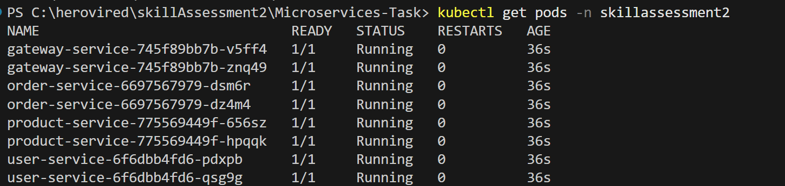

#### Services Running
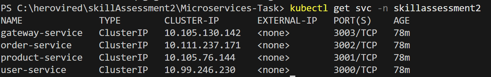


---

### Step 4: Internal Testing
Run a debug pod with curl:
```bash
kubectl run curlpod -n skillassessment2 --rm -it --image=curlimages/curl -- sh
```

Inside curlpod:
```bash
curl user-service:3000/users
curl product-service:3001/products
curl order-service:3002/orders
```

---

### Step 5: External Testing
Expose Gateway service via port-forward:
```bash
kubectl port-forward -n skillassessment2 svc/gateway-service 3003:3003
```
#### port forwarding
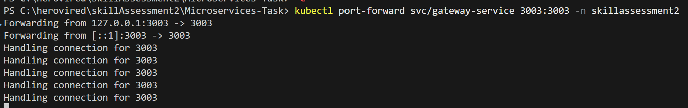


From local machine:

#### http://localhost:3003/api/users


#### http://localhost:3003/api/products


#### http://localhost:3003/api/orders


#### http://localhost:3003/api/health


---

### Step 6: Logs Validation
```bash
kubectl logs -n skillassessment2 <gateway-pod-name>
kubectl logs -n skillassessment2 <user-service-pod-name>
```

#### logs
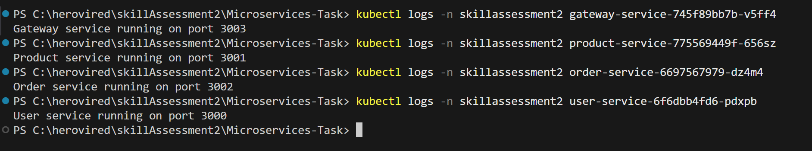

---

### 🌐 Ingress Setup

This section explains how to configure **NGINX Ingress** to expose microservices under a single domain.

---

#### 1️⃣ Prerequisites
- Kubernetes cluster running (Docker Desktop, Minikube, etc.).
- NGINX Ingress Controller installed:
  ```bash
  kubectl get pods -n ingress-nginx
  ```
  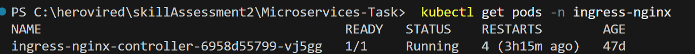

- Update your hosts file to resolve the custom domain:

  **Windows**: `C:\Windows\System32\drivers\etc\hosts`  
  Add:
  ```
  127.0.0.1 microservices.local
  ```
  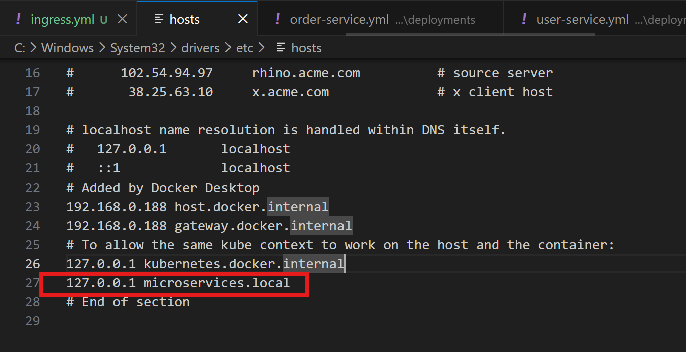

---

#### 2️⃣ Create Ingress Resource
Create `ingress.yaml`:

```yaml
apiVersion: networking.k8s.io/v1
kind: Ingress
metadata:
  name: microservices-ingress
  namespace: skillassessment2
  annotations:
    nginx.ingress.kubernetes.io/rewrite-target: /
spec:
  ingressClassName: nginx
  rules:
  - host: microservices.local
    http:
      paths:
      - path: /users
        pathType: Prefix
        backend:
          service:
            name: user-service
            port:
              number: 3000
      - path: /products
        pathType: Prefix
        backend:
          service:
            name: product-service
            port:
              number: 3001
      - path: /orders
        pathType: Prefix
        backend:
          service:
            name: order-service
            port:
              number: 3002
      - path: /
        pathType: Prefix
        backend:
          service:
            name: gateway-service
            port:
              number: 3003
```

##### Apply:
```bash
kubectl apply -f .\Microservices\k8s\ingress\ingress.yml -n skillassessment2
```
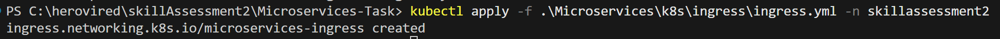


---

#### 3️⃣ Verify Ingress
Check rules:
```bash
kubectl get ingress -n skillassessment2
kubectl describe ingress microservices-ingress -n skillassessment2
```
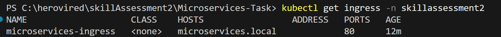
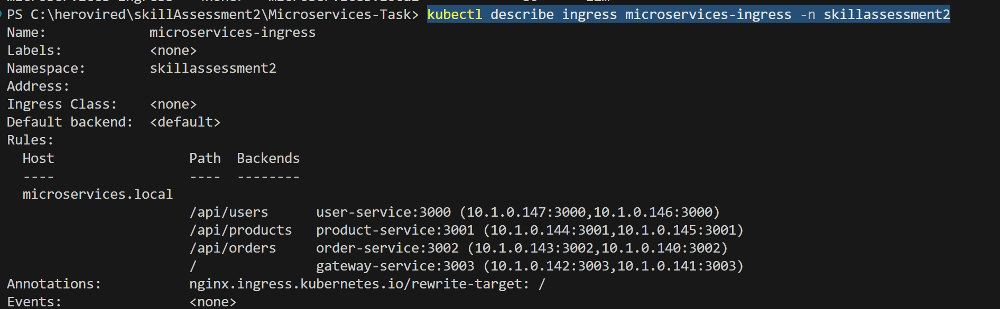

---

#### 4️⃣ Test Endpoints
Open browser or run:
```bash
http://microservices.local/api/users
http://microservices.local/api/products
http://microservices.local/api/orders
http://microservices.local/health
```

Expected output:
- `/api/users` → JSON list of users  
- `/api/products` → JSON list of products  
- `/api/orders` → JSON list of orders  or blank if no order
- `/health` → Gateway service response  

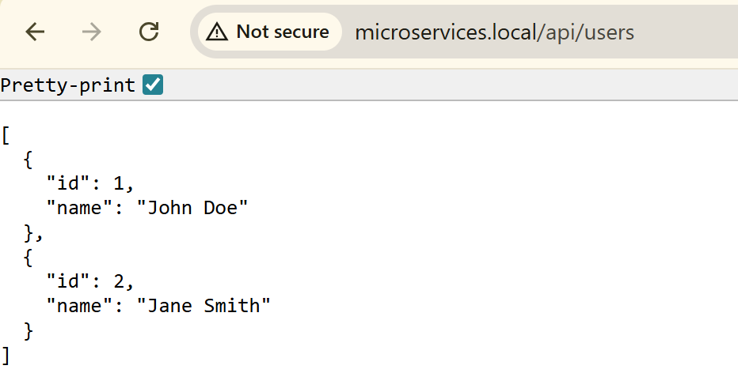
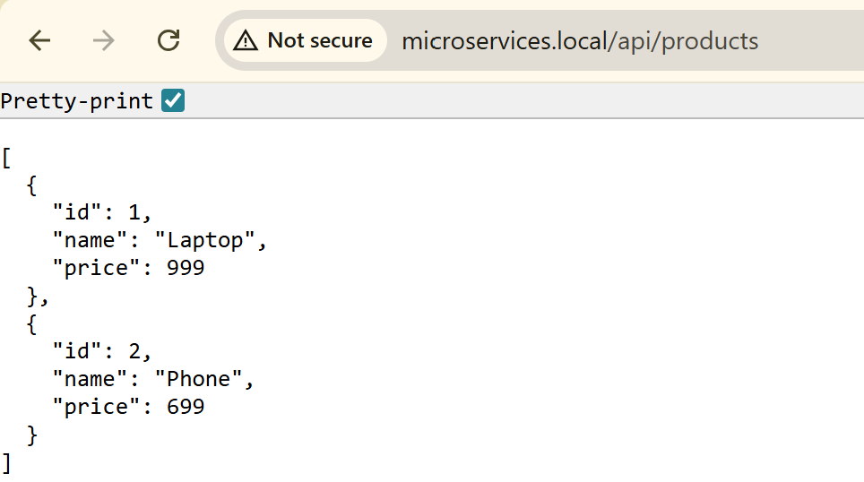
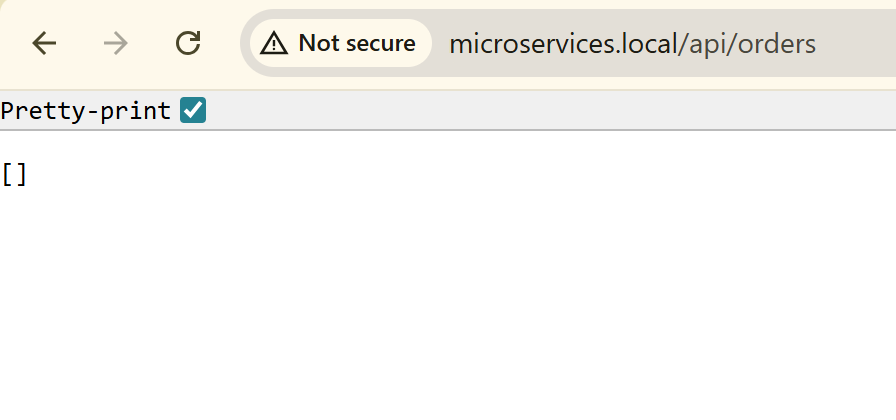
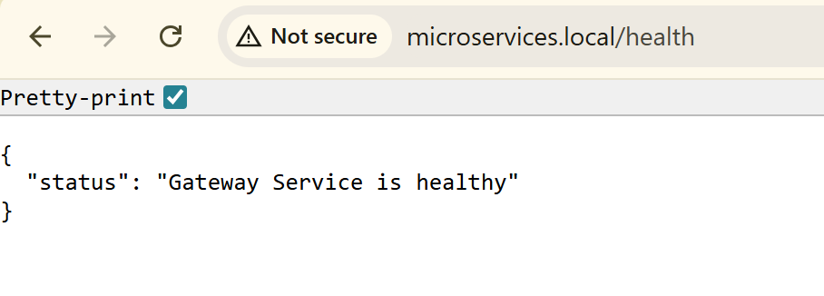

#### 🔄 Parallel request/response flow through Ingress
This diagram shows how traffic travels into the cluster and how the response comes back through the same path.
```
Request Flow (Client → Pod)              Response Flow (Pod → Client)
---------------------------              ----------------------------
Browser (http://microservices.local)     Browser
        |                                        ^
        v                                        |
Ingress (NGINX)                          Ingress (NGINX)
  - Matches /api/users                   - Forwards response to Browser
  - Rewrites -> /users                          ^
        |                                        |
        v                                        |
Kubernetes Service (user-service:3000)   Kubernetes Service
  - ClusterIP forwards to Pod            - Passes response back to Ingress
        |                                        ^
        v                                        |
User Service Pod                          User Service Pod
  - Node.js app serves /users             - Returns JSON [{id:1,name:"John Doe"},...]

```

---

## ⚠️ Troubleshooting & Errors Faced

1. **InvalidImageName**  
   - Cause: Wrong image references in Deployment YAMLs.  
   - Fix: Corrected to match DockerHub tags (`dockerprogrammer/skillassessment2:<service>`).
   - Also removed latest at the end.

2. **Service YAML using `apps/v1`**  
   - Cause: Services mistakenly defined with `apiVersion: apps/v1`.  
   - Fix: Changed to `apiVersion: v1`.

3. **Pods stuck at `0/1 Running`**  
   - Cause: Readiness/Liveness probes pointing to non-existent `/health` and `/ready`.  
   - Fix: Checked codebase for each service and found /health endpoint and utilized same for all services. Updated probes to point to actual endpoints (`/health`, `/health`, `/health`, `/health`).

4. **curl not found inside service containers**  
   - Cause: Slim Node.js images don’t include curl.  
   - Fix: Used a debug pod (`curlimages/curl`) for internal testing.

5. **kubectl connected to remote EKS cluster**  
   - Cause: Context was set to AWS EKS.  
   - Fix: Switched back with `kubectl config use-context docker-desktop`.
     
6.  **Ingress Not Working / 503 Service Temporarily Unavailable**
    - Cause: Ingress controller not picking up rules.
    - Fix:
        - Ensure NGINX ingress controller is running
          ```
              kubectl get pods -n ingress-nginx
          ```
        - Add ingressClassName: nginx in your Ingress spec.
        - Verify services and endpoints exist:
            ```
                kubectl get svc -n skillassessment2   
                kubectl get endpoints -n skillassessment2
            ```
7. **Cannot GET /**  
   - Cause: Path mismatch between Ingress and service.
   - Fix:
   - If using /api/... externally, add rewrite annotation:
     ```
     annotations:
      nginx.ingress.kubernetes.io/rewrite-target: /
     ```
     - Ensure service actually serves /users, /products, /orders.
     - Example: /api/users → Ingress rewrites to /users.

---

## ✅ Deliverables
- **Deployment YAMLs** for all services.  
- **Service YAMLs** for all services.
- **ingress YAML** having mapping of all services. 
- **README.md** with setup, testing, troubleshooting, and screenshots.  
- **Screenshots** showing pods, logs, and service tests.  
