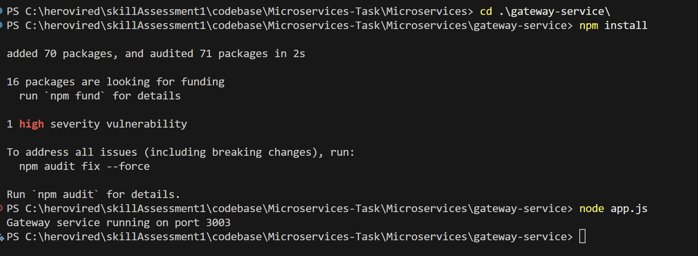
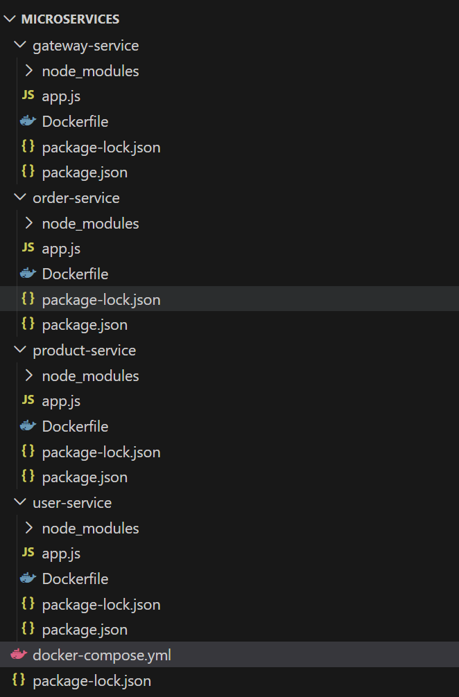
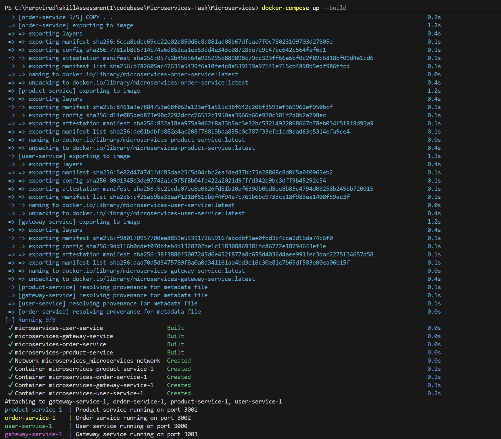
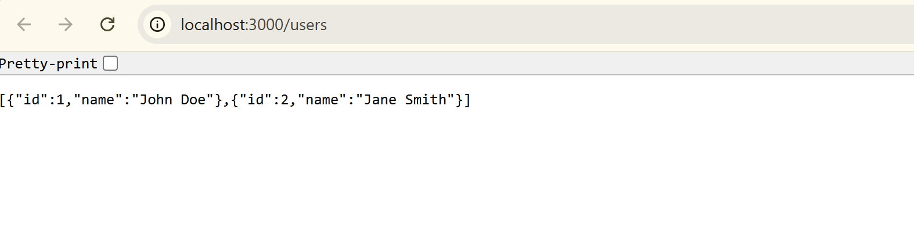
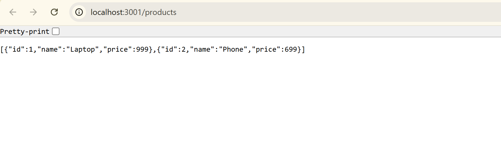
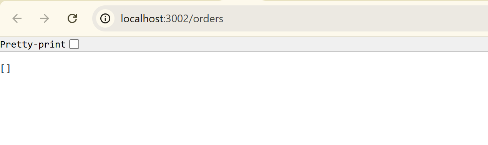
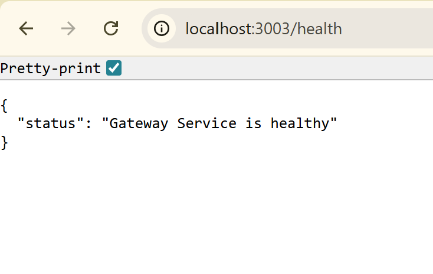
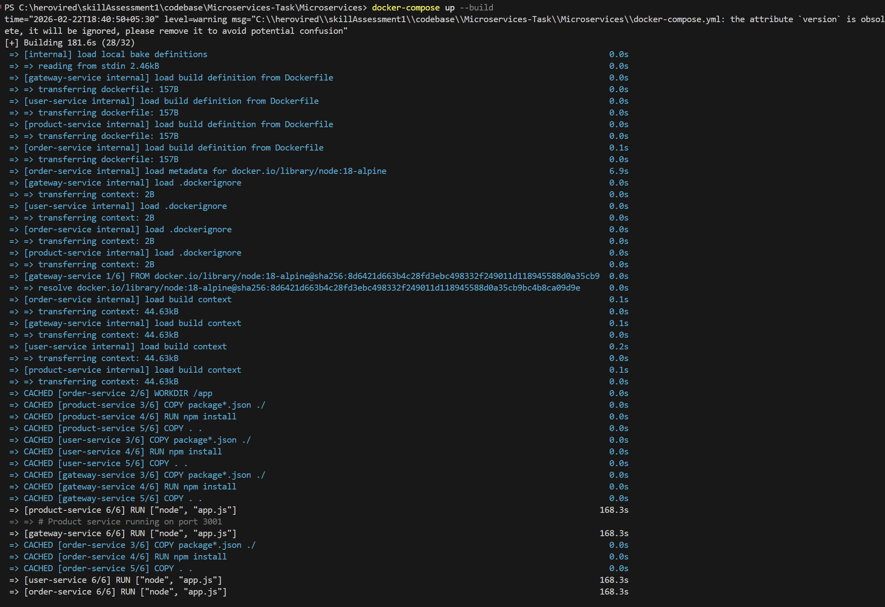

# 🐳 Microservices Containerization Task

## 📌 Problem Analysis
You are provided with source code for **four Node.js microservices**:
- **User Service** (Port 3000)  
- **Product Service** (Port 3001)  
- **Order Service** (Port 3002)  
- **Gateway Service** (Port 3003)  

The challenge is to **containerize** each service using Docker and orchestrate them with Docker Compose.  
Key requirements:
- Each service must have its own **Dockerfile**.
- A single **docker-compose.yml** must define and run all services.
- Services should communicate over a shared Docker network.
- Documentation must include setup, testing, troubleshooting, and screenshots.

---
## Details of Services and Endpoints

### **User Service**
- **Base URL:** `http://localhost:3000`
- **Endpoints:**
  - **List Users:**  
    ```
    curl http://localhost:3000/users
    ```
    Or open in your browser: [http://localhost:3000/users](http://localhost:3000/users)

---

### **Product Service**
- **Base URL:** `http://localhost:3001`
- **Endpoints:**
  - **List Products:**  
    ```
    curl http://localhost:3001/products
    ```
    Or open in your browser: [http://localhost:3001/products](http://localhost:3001/products)

---

### **Order Service**
- **Base URL:** `http://localhost:3002`
- **Endpoints:**
  - **List Orders:**  
    ```
    curl http://localhost:3002/orders
    ```
    Or open in your browser: [http://localhost:3002/orders](http://localhost:3002/orders)

---

### **Gateway Service**
- **Base URL:** `http://localhost:3003/api`
- **Endpoints:**
  - **Users:**  
    ```
    curl http://localhost:3003/api/users
    ```
  - **Products:**  
    ```
    curl http://localhost:3003/api/products
    ```
  - **Orders:**  
    ```
    curl http://localhost:3003/api/orders
    ```

---

## Instructions
1. Start all services using the `docker-compose` file:
   ```
   docker-compose up
   ```
2. Once the services are running, use the above endpoints to verify the functionality.

Happy testing!


---


## 🚀 Solution Implementation (Step-by-Step)

### Step 1: Microservices local testing

Test each services locally to confirm If sourcecode is working fine and then proceed for Dockerfile creation.

Go inside each service and execute below 
```
npm install

node app.js
```



### Step 2: Repository Structure
```
submission/
├── user-service/
│   └── Dockerfile
├── product-service/
│   └── Dockerfile
├── order-service/
│   └── Dockerfile
├── gateway-service/
│   └── Dockerfile
├── docker-compose.yml
└── README.md
```



We will follow above shown structure for Dockerfile creation. 

---

### Step 3: Dockerfile Creation
Each service has a similar Dockerfile pattern:

```dockerfile
# Example: User Service
FROM node:18-alpine
WORKDIR /app
COPY package*.json ./
RUN npm install
COPY . .
EXPOSE 3000
CMD ["node", "app.js"]
```

Repeat for **Product Service (3001)**, **Order Service (3002)**, and **Gateway Service (3003)** with correct ports.

---

### Step 4: Docker Compose Configuration
Create a `docker-compose.yml`:

```yaml
version: "3.8"
services:
  user-service:
    build: ./user-service
    ports:
      - "3000:3000"
    networks:
      - microservices-net

  product-service:
    build: ./product-service
    ports:
      - "3001:3001"
    networks:
      - microservices-net

  order-service:
    build: ./order-service
    ports:
      - "3002:3002"
    networks:
      - microservices-net

  gateway-service:
    build: ./gateway-service
    ports:
      - "3003:3003"
    networks:
      - microservices-net

networks:
  microservices-net:
    driver: bridge
```

---

### Step 5: Local Testing & Validation
1. Build and start containers:
   ```bash
   docker-compose up --build
   ```
  


   
2. Verify services:
   - User Service → `http://localhost:3000`
   - Product Service → `http://localhost:3001`
   - Order Service → `http://localhost:3002`
   - Gateway Service → `http://localhost:3003`







---

### Step 6: Troubleshooting Tips
- **Port conflicts**: Ensure ports 3000–3003 are free before running.
- **Dependency errors**: Run `npm install` locally to confirm `package.json` is valid.
- **Container logs**: Use `docker-compose logs -f <service-name>` to debug.
- **Rebuild images**: If changes don’t reflect, run:
  ```bash
  docker-compose build --no-cache
  ```

If you see that the services are stuck as shown below then check if you have used RUN inside Dockerfile 
``` RUN["node", "app.js"] ``` 

Instead we need to use   

``` CMD["node", "app.js"] ```   


---

## ✅ Deliverables
- **Dockerfiles** for all services.
- **docker-compose.yml** orchestrating all services.
- **README.md** with setup, testing, troubleshooting, and screenshots.
